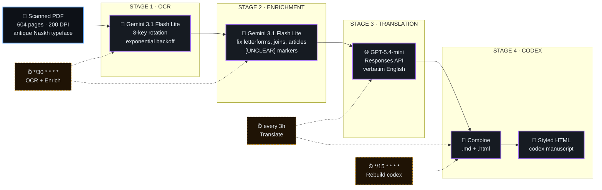

<div align="center">

# شمس المعارف الكبرى
### *Shams al-Ma'arif al-Kubra — The Great Sun of Gnoses*

**An end-to-end OCR · AI Enrichment · English Translation pipeline**
**for Ahmad al-Buni's 13th-century Arabic grimoire (604 pages).**

<br/>

[](#)
[](#-progress)
[](#-progress)
[](#-progress)
[](#-progress)
[](#-pipeline-stages)
[](#stage-3--translation--english-verbatim)
[](#-license)
[](#-document-details)

<br/>

> *"In the Name of Allah, the Most Gracious, the Most Merciful —*
> *a book of luminous secrets, divine names, and the hidden currents that move the spheres."*
> — Ahmad al-Buni, opening of the *Shams al-Ma'arif*

<br/>

[**🏛 Architecture**](#-architecture) · [**⚡ Quick Start**](#-quick-start) · [**🧠 Pipeline**](#-pipeline-stages) · [**📊 Progress**](#-progress) · [**🔧 Troubleshooting**](#-troubleshooting) · [**📖 Document**](#-document-details)

<br/>

</div>

---

## ✨ Highlights

- 🤖 **Multi-model pipeline** — Gemini 3.1 Flash Lite for OCR/enrichment · GPT-5.4-mini for translation
- 🔁 **8-key rotation** — bypasses free-tier rate limits and survives crashes via persistent state
- 🧬 **Verbatim by design** — never summarises, never rephrases; marks `[UNCLEAR]` instead of guessing
- 📜 **604 / 604 pages** processed end-to-end (100% OCR · 100% Enriched · 100% Translated)
- 🕐 **Fully automated** — three cron jobs keep the pipeline ticking 24/7
- 🪶 **HTML codex** — paragraph rejoining, Arabic font wrapping, section detection
- 🔐 **Auditable** — every translation page is git-tracked; secrets are git-ignored
- ♻️ **Resumable** — JSON state survives crashes, terminal sessions, and reboots

---

## 🏛 Architecture

The pipeline is a four-stage DAG. Each stage reads from a previous stage's output directory and writes to the next. State is persisted as JSON so cron cycles, crashes, and terminal sessions all resume seamlessly.



### Key Design Decisions

| Decision | Rationale |
|---|---|
| 🔁 **Multi-key rotation (8 keys)** | Free-tier Gemini caps at ~60 RPM / 50 RPD per key — rotation unlocks continuous throughput. |
| 📑 **3 pages per API call** | Respects per-key rate limits while maximising batch efficiency. |
| 🚧 **Verbatim + `[UNCLEAR]` markers** | When the model is uncertain, it flags ambiguity rather than inventing text. |
| 🌿 **Git-tracked outputs** | Every translation page is committed — full, immutable audit trail. |
| 💾 **Persistent JSON state** | Resumable across crashes, cron cycles, and terminal sessions. |
| 🧠 **Two-model split** | Gemini for visual/textual tasks (OCR, enrichment); GPT-5.4-mini for English translation. |

---

## ⚡ Quick Start

> Requires Python 3.10+, `requests`, and `pillow`. Optional: 8 Gemini + 8 OpenAI API keys for full rotation.

```bash
# ── 1. Clone & enter ─────────────────────────────────────────────
git clone https://github.com/USER/shams-al-maarif-ocr.git
cd shams-al-maarif-ocr

# ── 2. Virtual env ───────────────────────────────────────────────
python3 -m venv .venv && source .venv/bin/activate
pip install requests pillow

# ── 3. Drop your API keys (one base64 blob per line) ─────────────
$EDITOR ocr/translate_keys.py        # 8 OpenAI keys
# Gemini keys live in scripts/ via gemini_rotate.py

# ── 4. Run a single OCR page ──────────────────────────────────────
python3 scripts/ocr_gemini.py 42

# ── 5. Manual batch (10 pages, ~15 min) ──────────────────────────
bash scripts/run_batch.sh

# ── 6. Translation ───────────────────────────────────────────────
cd ocr
python3 translate_en.py --status          # progress
python3 translate_en.py --gentle          # 6 pages (gentle, low rate)
python3 translate_en.py --range 60-80     # specific range
python3 translate_en.py --retry-failed    # retry anything that errored
python3 translate_en.py --all             # translate everything pending

# ── 7. Rebuild the codex ─────────────────────────────────────────
cd ..
python3 scripts/build_html_book.py
# → manuscript/shams-al-maarif-verbatim.html
```

<details>
<summary>📋 <b>One-line summary of the most-used commands</b></summary>

| Goal | Command |
|---|---|
| OCR + enrich 10 pages | `bash scripts/run_batch.sh` |
| Translate 6 pages | `cd ocr && python3 translate_en.py --gentle` |
| Check pipeline status | `python3 scripts/progress_manager.py status` |
| Rebuild combined .md/.html | `bash ~/.hermes/scripts/shams_combine_en.sh` |
| Build styled codex | `python3 scripts/build_html_book.py` |

</details>

---

## 📁 Repository Structure

```
shams-al-maarif-ocr/
├── 📄 README.md                          ← you are here
├── 📄 PIPELINE_STATUS.md                 ← real-time pipeline health
├── 📄 manifest.json                      ← document metadata
├── 📄 .gitignore                         ← API keys, logs, runtime state
│
├── 📂 scripts/                           ← pipeline engines
│   ├── ocr_gemini.py                     ← STAGE 1: Gemini Arabic OCR
│   ├── enrich_gemini.py                  ← STAGE 2: AI post-correction
│   ├── progress_manager.py               ← shared state tracker
│   ├── run_batch.sh                      ← cron: OCR + enrich (10 pp)
│   ├── batch_process_all.sh              ← backfill: pages 363 → 604
│   ├── git_auto_push.sh                  ← commit & push after batch
│   └── build_html_book.py                ← STAGE 4: styled HTML codex
│
├── 📂 ocr/
│   ├── 📂 raw/                           ← raw Gemini output (untouched)
│   │   └── page_{001..604}.txt
│   ├── 📂 enriched/                      ← OCR noise corrected
│   │   └── page_{001..604}.txt
│   ├── 📂 enriched_en/                   ← English translations
│   │   └── page_{001..604}.txt           (604 pages, 589 with content)
│   ├── translate_en.py                   ← STAGE 3: English engine
│   ├── translate_keys.py                 ← 8 API keys (gitignored)
│   ├── .translate_state.json             ← translation state (gitignored)
│   ├── shams-al-maarif-en-complete.md    ← combined .md  · 4.9 MB · 35 971 lines
│   ├── shams-al-maarif-en-complete.html  ← combined .html · 5.4 MB
│   └── 📂 logs/                          ← runtime debug logs (gitignored)
│
├── 📂 state/
│   ├── progress.json                     ← per-page OCR/enrich status
│   └── batch_log.json                    ← batch run history
│
└── 📂 manuscript/
    └── shams-al-maarif-verbatim.html     ← styled book manuscript
```

---

## 🧠 Pipeline Stages

### Stage 1 · OCR — Gemini Arabic Extraction

**Script:** `scripts/ocr_gemini.py`

Each page PDF is sent to Google **Gemini 3.1 Flash Lite** with a carefully crafted Arabic-extraction prompt. The driver rotates across **8 API keys** to bypass free-tier rate limits.

```bash
# Single page
python3 scripts/ocr_gemini.py 42

# Batch (run_batch.sh processes the next 10 pending pages)
bash scripts/run_batch.sh
```

**Key features**

- 🔁 Multi-key rotation with persistent state (survives crashes)
- ⏱ Exponential backoff on `429 rateLimitExceeded` (max 5 retries per page)
- 📄 Blank-page detection — folios with <100 chars are marked `blank`, not `failed`
- ✍️ Verbatim mode — never summarises, never invents
- 💾 Output: `ocr/raw/page_NNN.txt` (untouched Gemini response)

### Stage 2 · Enrichment — AI Post-Correction

**Script:** `scripts/enrich_gemini.py`

Raw OCR may contain broken letterforms, ink-smudge artefacts, and merged/split words from antique Naskh. This stage cleans the text without losing a single word.

```bash
# Single page
python3 scripts/enrich_gemini.py 42

# Diff examples:
#   ❌ "سـاحر"  → ✅ "ساحر"     (fix broken letter joins)
#   ❌ "ألرحمن" → ✅ "الرحمن"   (fix article splitting)
#   ❌ "مجهول"  → ✅ "مجهول[?]" (mark uncertainty, keep text)
```

**Four rules, no exceptions**

1. 🚫 **Never deletes** content — uncertain passages are preserved with `[?]`
2. 🚫 **Never rephrases** — this is correction, not rewriting
3. 🚫 **Never summarises** — every word of the original stays
4. 🤝 **When uncertain** → keep the raw text + `[?]` suffix

### Stage 3 · Translation — English Verbatim

**Script:** `ocr/translate_en.py`

Enriched Arabic pages are translated into English using OpenAI **gpt-5.4-mini** (Responses API) with 8-key rotation.

```bash
python3 translate_en.py --status              # progress
python3 translate_en.py --gentle              # 6 pages (2 API calls, 15 s apart)
python3 translate_en.py --range 60-80         # specific range
python3 translate_en.py --retry-failed        # retry failed pages
python3 translate_en.py --all                 # translate everything remaining
```

**Translation rules (enforced in the system prompt)**

1. 📚 **Preserve technical terms** — Raml (رمل), Shakl (شكل), Watad (وتد), Ruhaniyyah (روحانية)
2. 🕊 **Preserve honourifics**, invocations, and repeated phrases
3. 🔢 **Preserve grid / diagram / number-square content** as-is
4. 🚫 **No interpretation**, commentary, or cultural adaptation
5. ⚖️ **When forced to choose** → accurate English > smooth English

**State persistence** — `.translate_state.json` tracks:

| Field | Meaning |
|---|---|
| `completed` | Successfully translated page numbers |
| `failed` | Permanently failed (rate limit exhaustion) |
| `key_index` | Which API key was active (survives crashes) |

### Stage 4 · HTML Codex Assembly

**Script:** `scripts/build_html_book.py`

Assembles enriched English pages into a styled HTML book manuscript with:

- 🔗 **Intelligent paragraph rejoining** — fragmented OCR lines → proper paragraphs
- 📑 **Section heading detection**
- 🪶 **Arabic span wrapping** for proper font rendering
- 📏 **Uniform typographic spacing**

```bash
python3 scripts/build_html_book.py
# → manuscript/shams-al-maarif-verbatim.html
```

### External Combine Scripts (`~/.hermes/scripts/`)

| Script | Function |
|---|---|
| `shams_combine_en.sh` | Merges all `enriched_en/page_NNN.txt` → complete `.md` + `.html` |
| `shams_translate_gentle.sh` | Cron wrapper: translation + combine |
| `shams_to_html.py` | Alternative HTML generator for combined markdown |

---

## 🕐 Cron Jobs

| Job | Schedule | What it does | Max pages / run |
|---|---|---|:-:|
| `shams-al-maarif-ocr-enrichment` | `*/30 * * * *` | OCR + enrich next 10 pending pages | **10** |
| `shams-translate-gentle` | every 3 h | Translate 6 pages + rebuild combined files | **6** |
| `shams-enrich-complete` | `*/15 * * * *` | Standalone rebuild of `.md` + `.html` from latest | — |

**Timing formula for cron intervals**

```
max_batch = floor(interval / (t_ocr + t_enrich + t_push))
Example: 30 min cron / (90 s per page × 2 stages + 30 s push) ≈ 10 pages
```

---

## 📊 Progress

```bash
# Pipeline status
python3 scripts/progress_manager.py status

# Translation status
cd ocr && python3 translate_en.py --status
```

| Metric | Value |
|---|---|
| 📄 Total pages | **604** |
| 📃 Pages with text | **589** (15 blank/folio placeholders) |
| 🟢 Raw OCR complete | **604 / 604** (✅ 100 %) |
| 🟢 Enriched | **604 / 604** (✅ 100 %) |
| 🟢 Translated | **604 / 604** (✅ 100 % — 589 with content) |
| 🔴 Failed | **0** |
| 🧠 OCR / Enrich model | Gemini 3.1 Flash Lite |
| 🌐 Translation model | OpenAI gpt-5.4-mini (Responses API) |
| 🔑 API keys | 8 (rotated on rate limit) |
| 📑 Combined `.md` | 4.9 MB · 35 971 lines |
| 📑 Combined `.html` | 5.4 MB |

---

## 🔧 Troubleshooting

| Symptom | Cause | Fix |
|---|---|---|
| `429 rateLimitExceeded` | Free-tier key exhausted | Auto-rotates to next key. If all 8 exhausted, wait 60 s. |
| `RECITATION` finish reason | Gemini safety filter | Shorten prompt to 12 words: `"Extract all visible text verbatim"`. |
| `Failed: exit code` | Network / API timeout | Increase `PER_PAGE_TIMEOUT` to 300 s, then `--retry-failed`. |
| Empty page output | Genuinely blank folio | Correct — marked as `blank`, **not** `failed`. |
| Enriched text missing words | Aggressive correction | Diff raw vs enriched; lower correction strength. |
| Git push fails | Network / auth | Run `bash scripts/git_auto_push.sh` manually. |
| `.venv` permission denied | Hermes-owned venv | Use `pip install --user` or create venv outside Hermes home. |

<details>
<summary>🩺 <b>Diagnostic commands</b></summary>

```bash
# Inspect a specific page
cat ocr/raw/page_042.txt
cat ocr/enriched/page_042.txt
cat ocr/enriched_en/page_042.txt

# State files
cat state/progress.json | python3 -m json.tool | head -50
cat ocr/.translate_state.json | python3 -m json.tool

# Logs
tail -n 200 ocr/logs/*.log
```

</details>

---

## 🔐 Git Security

The following are **never committed** (blocked by `.gitignore`):

| Pattern | Contents |
|---|---|
| `translate_keys.py` | 8 OpenAI API keys (base64-encoded) |
| `.translate_env` | Legacy single-key env file |
| `.translate_state.json` | Runtime state (includes `key_index`) |
| `ocr/logs/` | Debug logs (may contain request/response data) |

> ✅ Translation output files (`enriched_en/`, `shams-al-maarif-en-complete.*`) **are** tracked — they are the pipeline's deliverable.

---

## 📖 Document Details

| Field | Value |
|---|---|
| **Title** | شمس المعارف الكبرى ولطائف العوارف |
| **English** | The Great Sun of Gnoses and the Subtleties of the Knowledges |
| **Author** | أحمد بن علي البوني — Ahmad ibn Ali al-Buni (d. 1225 CE / 622 AH) |
| **Subject** | Lettrism (*ʿilm al-ḥurūf*), esoteric sciences, divination, occult properties of Divine Names and Quranic verses |
| **Edition** | Cairo printing, collated against Egypt & India editions + al-Hajj Mirza Husayn manuscript |
| **Editor** | Shaykh ʿAbd al-Raḥmān al-Jazīrī (الشيخ عبد الرحمن الجزيرى) |
| **Language** | Classical Arabic |
| **Pages** | 604 (589 with text, 15 blank / folio placeholders) |
| **Source** | Scanned PDF · 200 DPI · antique Naskh typeface |
| **OCR Engine** | Gemini 3.1 Flash Lite |
| **Translation** | OpenAI gpt-5.4-mini (Responses API) |
| **Pipeline** | v1.0.0 |

---

## 🌐 Web Reader (Deployed App)

The OCR output is surfaced to readers through a **Next.js 16 web app**, deployed to Vercel.

| | Path | Role |
|---|---|---|
| **Source repo** | `C:/Workspace/shams-al-maarif` | Canonical app code — **edit here** |
| **Deploy repo** | this repo (`shams-al-maarif-ocr`), `web/` subdir | Push `main` → GitHub Actions → Vercel |
| **Served data** | `web/public/manuscript.json` | Regenerated from `ocr/enriched*` via `scripts/build_manuscript_json.py` |

> Prod: **https://shams-al-maarif.vercel.app**

### Features
- **3 languages** (Arabic / English / Indonesian) with RTL auto-flip for Arabic
- **OCR text view + scanned-page (PDF) view**, toggleable per folio; Page mode falls
  back to the OCR transcription when a scan is missing or errors (never a blank screen)
- **Last-read resume**, **bookmarks**, **reading progress** (% read)
- **Reading themes** (night / sepia / paper) + **line-height** control
- **Font size 4–72px** (2px steps), theme + typography persisted to localStorage
- **Deep links** `?page=N&lang=ar|en|id&mode=text|page` via SSR initial state (no flash)
- **Full-text search** across all languages with snippets + highlight
- **Auto-scroll**: one toggle cycles `Off → 1 → 2 → 3 → 4 → Off` (integer speed,
  level N = N×40 px/s). When ON and the page bottom is reached, a **10-second countdown**
  pill appears, then it auto-advances to the next page and keeps scrolling. When OFF,
  reaching the bottom does **not** start a countdown and does **not** advance.
- **Mobile parity**: a "More" (kebab) menu re-exposes desktop-only header controls
  (import / theme / grid / font / auto-scroll) below 640px
- **In-app import panel**: drag-drop a manuscript JSON to override data for the session
  (global `manuscript.json` always wins on reload)

### Stack
- **Next.js 16** (App Router, `app/`, no `src/`), **React 19**, **TypeScript strict**
- **Tailwind v4** (`@theme` design tokens)
- Fonts via `next/font/google`: Amiri (Arabic), Cormorant Garamond (serif), Inter (sans)
- Same-origin PDF proxy (`/api/scan/[page]`) → streams public R2 facsimiles
  (Cloudflare cross-origin embeds are blocked for real browsers, so the proxy is required)

### Deploy flow (two-repo, manual sync)
The source repo is the **canonical source**. Sync is **one-way** (source → this repo's
`web/`):

```bash
# after editing in C:/Workspace/shams-al-maarif, copy changed files into web/:
SRC=/C/Workspace/shams-al-maarif
DST="/c/Working Folder/Research/shams-al-maarif-ocr/web"
for f in components/ReaderApp.tsx components/TopBar.tsx components/icons.tsx; do
  cp -f "$SRC/$f" "$DST/$f"
done
# (data sync) cp "$SRC/public/manuscript.json" "$DST/public/manuscript.json"
cd "$DST" && git add -A && git commit -m "…" && git push origin main
# → GitHub Actions rebuilds + deploys; verify: gh run view <id> --json status,conclusion
```

**Commit discipline:** `git status` HANGS on this repo (untracked 7.7 MB `ocr/source/`),
so use `git diff --cached --name-only` for fast checks and **NEVER `git add -A`** here
from the OCR root — it would bulk-commit the untracked source dumps. Stage the `web/`
changes explicitly. Full recipe in skill **`nextjs-manuscript-reader`**
(`references/resync-ocr-translations.md`, `references/ocr-repo-commit-discipline.md`).

---

## 🤝 Contributing

Since this is a **verbatim preservation project**, any correction must be traceable:

1. 🔍 **Check the raw OCR** — was it a Gemini misread or an enrichment mistake?
2. 🔍 **Check the enriched Arabic** — is the source correct *before* translation?
3. ✏️ **If translation error** — note the page number + proposed correction.
4. 🐛 **Open an issue** — include page number, current text, and suggested fix.

---

## 📄 License

- 📜 The original text is in the **public domain** (13th century CE).
- 🛠 The OCR output, enrichment pipeline, translation tools, and generated artifacts are released under the **MIT License**.

---

<div align="center">

<br/>

*"This is a book of luminous secrets and hidden sciences…"*
<br/>
— Ahmad al-Buni, *Shams al-Ma'arif al-Kubra*

<br/>

<sub>Built with ❤ for the open humanities · Pipeline v1.0.0</sub>

</div>
